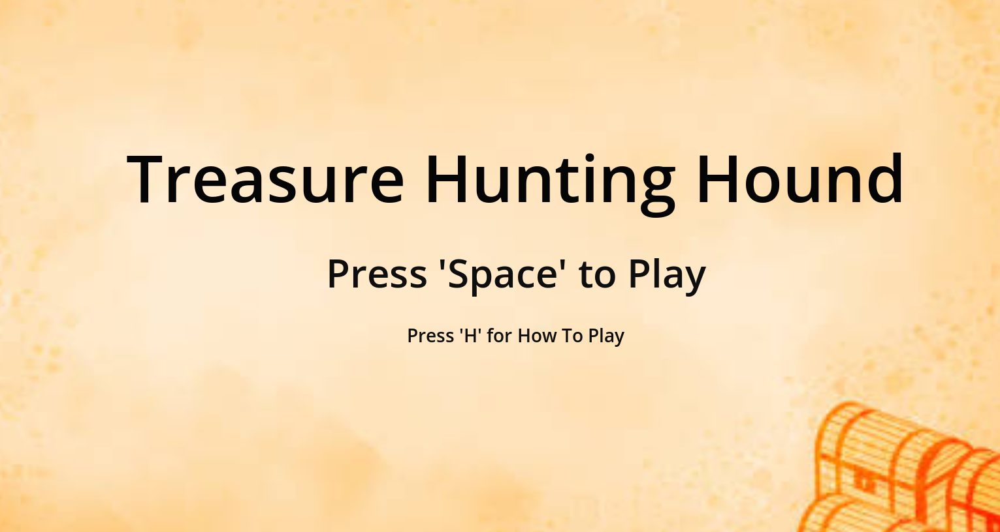
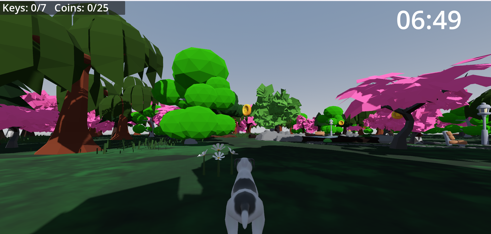
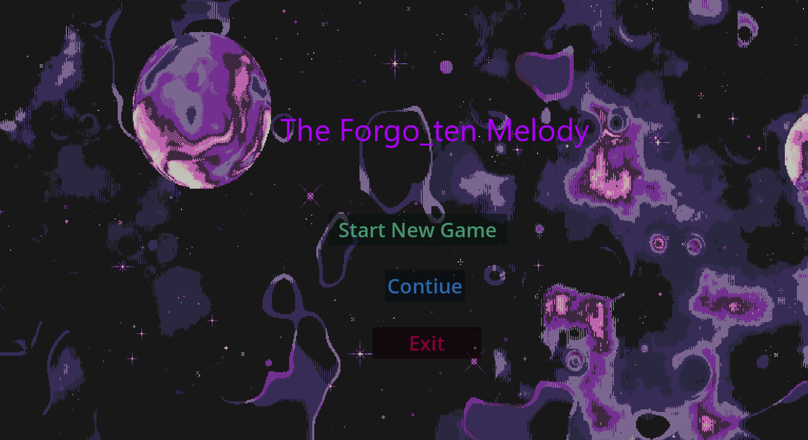
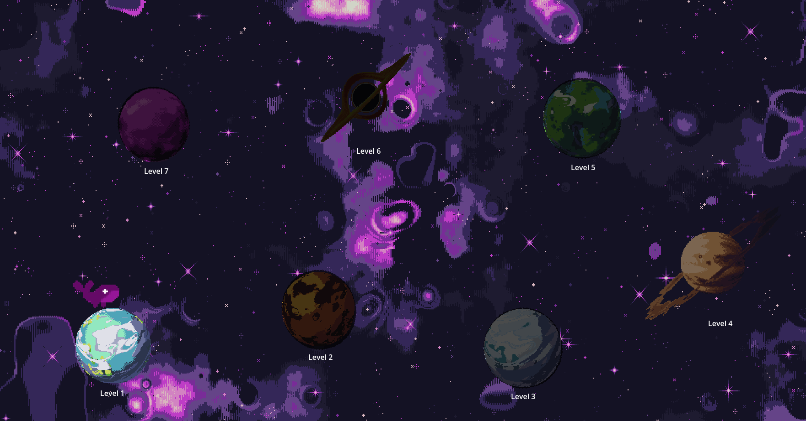
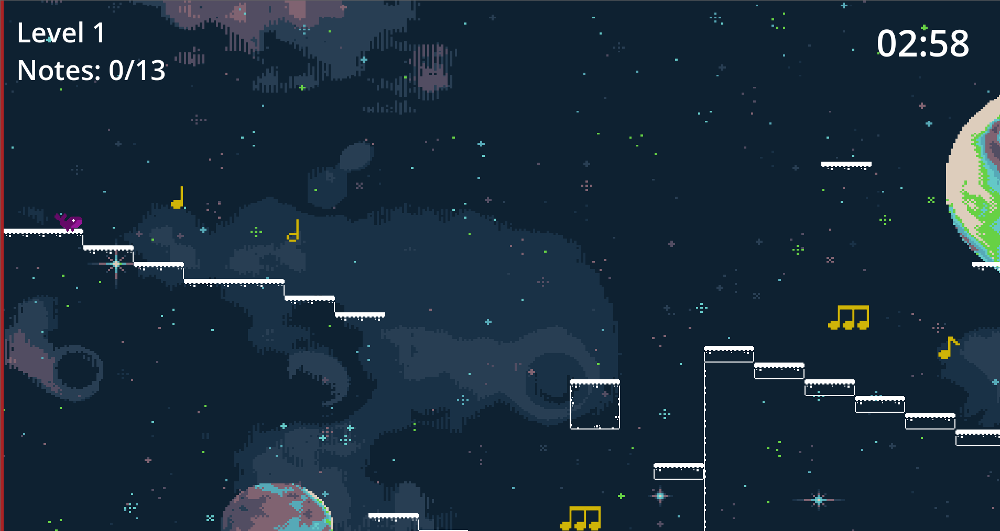
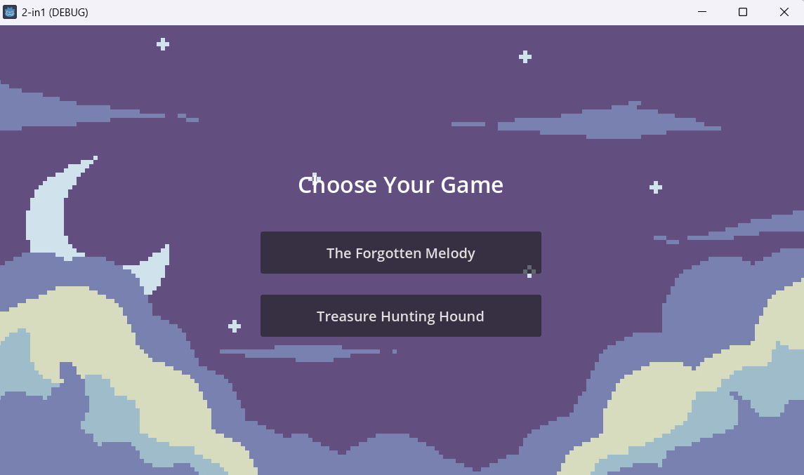

# 2-in-1 VP Project

Македонски / [English](#english)

---

A combined launcher that packages two independently developed games into a single entry point. Select a game from the launcher and it opens as its own process — no setup required.

Built with **Godot 4.3** · GDScript · Windows

---

## Игри / Games

- [Treasure-Hunting-Hound](#treasure-hunting-hound) — 3D истражување во прво лице / 3D first-person treasure hunt
- [The Forgotten Melody](#the-forgotten-melody) — 2D платформер / 2D platformer with a musical collectible mechanic

---

## Македонски

### Treasure-Hunting-Hound



3D игра во прво лице каде играш како куче и истражуваш голема отворена карта. Целта е да соберете **25 монети** и **7 клучеви** расфрлани низ средината и да стигнете до сандакот — сè во рок од **7 минути**.

#### Како се игра



- Движење со `WASD`, погледнете со глувчето, задржете `Shift` за трчање
- HUD-от на врвот на екранот го следи бројот на монети и клучеви во секое време
- Откако ќе соберете сè, одете до сандакот за да победите
- Ако тајмерот достигне нула пред да завршите, тоа е Game Over

#### Карактеристики

- Монетите и клучевите се поставуваат на случајни позиции на почетокот на секоја сесија
- Застанете премногу блиску до клуч повеќе од **5 секунди** и тој исчезнува и се појавува на друго место на картата
- Сандакот емитува посилен сјај со секој собран клуч, давајќи ви визуелен осет за напредок
- Сандакот се отвора само кога ќе се соберат сите 25 монети и сите 7 клучеви

---

### The Forgotten Melody



2D платформер каде играте како **Whalien** низ 7 рачно изработени нивоа. Секое ниво содржи **13 лебдечки музички ноти** — соберете ги сите за да го отворите порталот и да напредувате до следното ниво.

#### Како се игра





- Движење со `A` / `D` или стрелките, скокање со `Space`
- Секоја нота репродуцира уникатен звук кога се собира
- Соберете ги сите 13 ноти во ниво за да го отклучите излезниот портал, потоа влезете за да продолжите
- Паѓањето од картата го завршува нивото — можете да го повторите нивото или да се вратите во менито
- Завршете ги сите 7 нивоа за да достигнете Win Screen

#### Карактеристики

- Нотите лебдат со мазна анимација и се случајно распоредени на почетокот на секое ниво
- Нивоата се отклучуваат последователно — мора да завршите едно за да го пристапите следното
- Напредокот се зачувува автоматски по секое ниво, така што можете да продолжите од каде сте застанале
- Завршувањето на сите 7 нивоа активира конфети Win Screen

---

### Launcher



Минимално мени со едно копче за секоја игра. Кликнувањето на копче ја стартува избраната игра како посебен процес и го затвора launcher-от автоматски.

#### Структура на проектот

```
2-in-1/
├── 2-in-1.exe
├── The Forgo_ten Melody.exe
├── Treasure-Hunting-Hound.exe
└── godot-jolt_windows-x64_editor.dll
```

> `godot-jolt_windows-x64_editor.dll` мора да остане во истата папка со извршните датотеки за Treasure-Hunting-Hound да работи правилно.

---

### Клучни класи и функции

#### KeySpawner — `key_spawner.gd`

Одговорен за поставување на 7 клучеви на валидни позиции низ 3D картата на почетокот на секоја сесија и за управување со повторно спавнување на клучеви за време на игра.

При иницијализација, spawner-от работи во јамка додека не се најдат 7 валидни позиции. За секоја кандидатска позиција, генерира случајни X и Z координати во рамките на границите на картата и ги проверува според збир на правила за исклучување: позицијата не смее да паѓа внатре во областа на езерото, не смее да биде премногу блиску до сандакот или почетната точка на играчот и мора да биде најмалку 35 единици далеку од секој веќе поставен клуч. Ако сите услови поминат, клучот се поставува; во спротивно се генерира нов кандидат. За време на игра, ако играчот застане блиску до клуч повеќе од 5 секунди без да го собере, spawner-от го отстранува и повторно ја извршува истата логика на поставување за тој единечен клуч.

#### CoinSpawner — `coin_spawner.gd`

Одговорен за поставување на 25 монети на случајни позиции низ картата на почетокот на секоја сесија.

Логиката е поедноставна од KeySpawner — генерира случајни X и Z координати во рамките на границите на картата и само ја исклучува областа на езерото. Не се наметнува минимално растојание меѓу монетите, бидејќи монетите се побројни и нивното групирање има помал ефект врз играта. Сите 25 инстанци се поставуваат во единечна итерација при иницијализација на сцената и остануваат фиксни за остатокот од сесијата.

#### LevelBase — `level_base.gd`

Базна класа наследена од сите 7 нивоа во The Forgotten Melody. Ракува со сè што е заедничко низ нивоата: спавнување на ноти, проверка на услов за победа и активирање на Game Over.

На почетокот на секое ниво, итерира низ 13-те јазли на ноти и ги репозиционира секој на случајна координата во играчката област на нивото. Секоја нота исто така добива почетна позиција која се користи од синусна функција за да произведе мазна анимација на лебдење. Кога играчот собира нота, базната класа го ажурира бројачот и го отстранува јазолот. Откако бројачот ќе достигне 13, порталот се активира. Ако играчот падне од картата, базната класа го открива и го вчитува екранот Game Over.

---

### Контроли

| Акција | Treasure-Hunting-Hound | The Forgotten Melody |
|--------|------------------------|----------------------|
| Движење | `W` `A` `S` `D` | `A` / `D` или стрелки |
| Поглед | Глувче | — |
| Трчање | `Shift` | — |
| Скок | `Space` | `Space` |
| Излез / Мени | `ESC` | `ESC` |

---

### Видео од играта

Краток клип од играта е достапен подолу. За целосниот преглед, видете го [Dropbox снимањето](https://www.dropbox.com/scl/fo/fiu3sndv9cnaizjavf7hy/AIuWx5AAzjNyhMscLxnkeQY?rlkey=y2c020ngayyci2mexx1fgxsjn&st=ogq29rd3&dl=0).
На истиот линк ќе најдете и game.7z. За да ја играте играта треба да го симнете и екстрахирате овој фајл и да ја пусхтите играта со лансирање на 2-in-1.exe


---

### Изградено со

- [Godot 4.3](https://godotengine.org/)
- GDScript
- JoltPhysics3D — физички backend за Treasure-Hunting-Hound

---

### Употреба на вештачка интелигенција

ChatGPT беше употребен за време на развојот на овој проект за две цели: справување со грешки и помош при пишување на документацијата.

За време на развојот, беше консултиран за помош при идентификување и поправање на грешки при извршување во GDScript - вклучувајќи проблеми со null референци, поврзување на сигнали и логика за зачувување/вчитување. Error пораките и потребните делови од кодот беа споделени со моделот за да се најде причината и да се поправи грешката.

Документацијата на проектот исто така беше напишана со помош на ChatGPT, кој помогна со структурата, формулацијата и организацијата. Механиките во играта беа креирани со помош на видео туторијали од YouTube.

---

## English

### Treasure-Hunting-Hound


A 3D first-person game where you play as a dog exploring a large open map. Your goal is to collect **25 coins** and **7 keys** scattered across the environment and reach the treasure chest — all within a **7-minute** time limit.

#### Gameplay


- Move with `WASD`, look around with the mouse, hold `Shift` to run
- The HUD at the top of the screen tracks your coin and key count at all times
- Once you have collected everything, head to the chest to win
- If the timer reaches zero before you finish, it's Game Over

#### Features

- Coins and keys are placed at random positions at the start of every session
- Linger too close to a key for more than **5 seconds** and it despawns and reappears somewhere else on the map
- The chest emits a stronger glow with each key collected, giving you a visual sense of progress
- The chest only opens when all 25 coins and all 7 keys have been collected

---

### The Forgotten Melody


A 2D side-scrolling platformer where you play as **Whalien** across 7 handcrafted levels. Each level contains **13 floating musical notes** — collect them all to open the portal and advance to the next level.

#### Gameplay


- Move with `A` / `D` or the arrow keys, jump with `Space`
- Every note plays a unique sound when collected
- Collect all 13 notes in a level to unlock the exit portal, then enter it to proceed
- Falling off the map ends the run — you can retry the level or return to the menu
- Finish all 7 levels to reach the Win Screen

#### Features

- Notes float with a smooth bobbing animation and are randomly repositioned at the start of each run
- Levels unlock sequentially — you must complete one to access the next
- Progress is saved automatically after each level, so you can pick up where you left off
- Completing all 7 levels triggers a confetti Win Screen

---

### Launcher


A minimal menu with one button per game. Clicking a button launches the selected game as a separate process and closes the launcher automatically.

#### Project Structure

```
2-in-1/
├── 2-in-1.exe
├── The Forgo_ten Melody.exe
├── Treasure-Hunting-Hound.exe
└── godot-jolt_windows-x64_editor.dll
```

> `godot-jolt_windows-x64_editor.dll` must remain in the same folder as the executables for Treasure-Hunting-Hound to run correctly.

---

### Key Classes and Functions

#### KeySpawner — `key_spawner.gd`

Responsible for placing 7 keys at valid positions across the 3D map at the start of each session, and for managing key respawning during gameplay.

At initialisation, the spawner runs a loop until 7 valid positions have been found. For each candidate position, it generates random X and Z coordinates within the map boundaries and checks them against a set of exclusion rules: the position must not fall inside the lake area, must not be too close to the chest or the player's starting point, and must be at least 35 units away from any already-placed key. If all conditions pass, the key is placed; otherwise a new candidate is generated. During gameplay, if a player stands near a key for more than 5 seconds without collecting it, the spawner removes it and runs the same placement logic again for that single key.

#### CoinSpawner — `coin_spawner.gd`

Responsible for placing 25 coins at random positions across the map at the start of each session.

The logic is simpler than KeySpawner — it generates random X and Z coordinates within the map bounds and only excludes the lake area. No minimum distance between coins is enforced, since coins are more numerous and their clustering is less impactful on gameplay. All 25 instances are placed in a single pass at scene initialisation and remain fixed for the rest of the session.

#### LevelBase — `level_base.gd`

A base class inherited by all 7 levels in The Forgotten Melody. It handles everything that is common across levels: note spawning, the win condition, and the Game Over trigger.

At the start of each level, it iterates over the 13 note nodes and repositions each one at a random coordinate within the playable area of the level. Each note also receives a start position used by a sine function to produce a smooth floating animation throughout the session. When the player collects a note, a signal is received by the base class, which updates the counter and removes the node. Once the counter reaches 13, the portal is activated. If the player falls off the map, the base class detects it and loads the Game Over screen.

---

### Controls

| Action | Treasure-Hunting-Hound | The Forgotten Melody |
|--------|------------------------|----------------------|
| Move | `W` `A` `S` `D` | `A` / `D` or arrow keys |
| Look | Mouse | — |
| Run | `Shift` | — |
| Jump | `Space` | `Space` |
| Exit / Menu | `ESC` | `ESC` |

---

### Gameplay Video and Game Download

A short gameplay clip is available below. For the full playthrough, see the [Dropbox recording](https://www.dropbox.com/scl/fo/fiu3sndv9cnaizjavf7hy/AIuWx5AAzjNyhMscLxnkeQY?rlkey=y2c020ngayyci2mexx1fgxsjn&st=ogq29rd3&dl=0).
On the same link you can find a game.7z. To play the game you need to download and unzip this file and then launch the 2-in-1.exe


---

### Built With

- [Godot 4.3](https://godotengine.org/)
- GDScript
- JoltPhysics3D — physics backend for Treasure-Hunting-Hound

---

### Use of AI

ChatGPT was used during the development of this project for two purposes: error handling and documentation.

During development, it was consulted to help identify and fix runtime errors in GDScript - including null reference issues, signal connection problems, and save/load logic. Error messages and relevant code snippets were shared with the model to find the cause and get a way to fix the errors.

A part of the project documentation was also written with the assistance of ChatGPT, which helped with structure, wording, and organisation. The mehanics of the game were created with the help of YouTube video tutorials.
